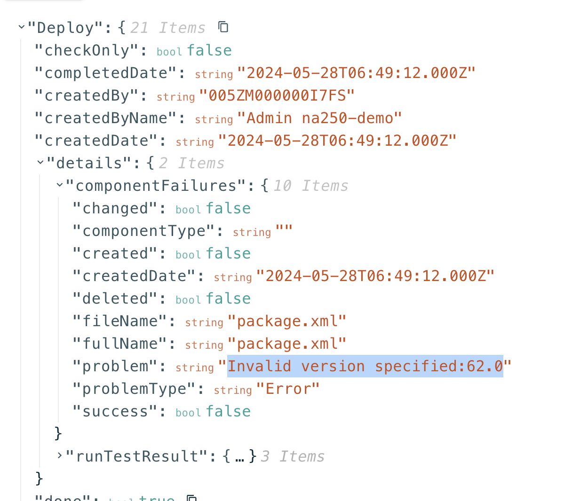

## Usage Instructions -

Open Workbench and go to the DEPLOY tab.  
Choose the WhatsApp_Routing.zip file and enable “Rollback On Error” and “Single Package”.  
Keep Testing as “None” and click the DEPLOY button.  
You should see the “status” as “Succeeded” in the response after a while.  
This will create an Omni-Channel flow named as “Whatsapp Routing Flow”.  
  
Please make following changes to “Whatsapp Routing Flow -  
Go to Setup -> Flows and click on “Whatsapp Routing Flow”.  
Reset the queue and service channel in “Default to Queue” and “Routing to same agent” Action. This is required so that the flows are pointing to right queue and service channels in your org.  
Open “Default to Queue” Action and reset “Service Channel” and “Queue Id”.  
For Service Channel, delete the Phone and then add Phone again.  
For Queue ID, delete the “WhatsApp Fallback Queue” and then add “WhatsApp Fallback Queue” again.  
Click on Done.  
Repeat the same steps for “Routing to same agent” Action and then click “Save As” to save the flow.  
Activate the flow.  

## Routing the WhatsApp Voice Call to the Same Agent 

By default, the Omni-Channel flow “Whatsapp Routing Flow” would route the voice calls to the same agent who was handling the WhatsApp messaging session.  

## Routing the WhatsApp Voice Call to a Different Agent

By default the above flow routes to the same agent. If you wanted to adjust the flow to point to a different Agent, you can edit the flow by following these steps -  
Set the Default Value of “routeToSameAgent” variable as {!$GlobalConstant.False}. You can find the attribute in the Manager tab on the left panel.  
This would trigger the No outcome of the  Decision element named “DoRouteToSameAgent”. By default the No outcome points to “Default to Queue” Action which in turn would route the calls to “WhatsApp Fallback Queue”. If you want to point it to a different queue, you can create a new action for pointing the calls to a different queue. Every queue that you create has a CallCenterRoutingMap object associated with it. Follow “Create CallCenterRoutingMap Object” section for that.	

## Error - Invalid version specified:61.0  
In case you face an invalid version error as can be seen this image, you need to update the version in the zip file.  
  

By default, the zip routing file assumes that workbench/api version used to import flow is 61.  
In case, you are using any other version, you need to do the following steps -  
Extract the zip file.  
Change version tag in package.xml from 61.0 to the relevant version.  
Change apiVersion tag in flows/WhatsApp_Routing.flow.xml from 61.0 to the relevant version.  
Compress the package.xml file, flows and flowDefinitions folder in a new zip.  

You can use the new zip for importing the flow.  